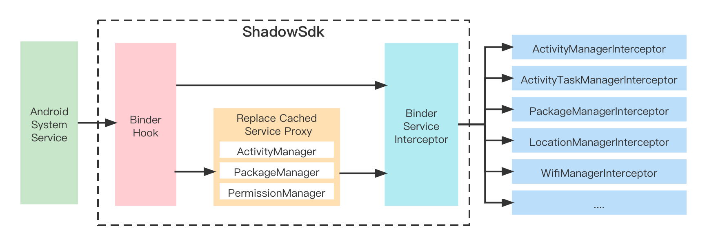

# 说明

## 1. `shadow`   

模块代理了android系统的service，同时提供了`ShadowServiceInterceptor`拦截器，用于拦截系统服务实现自定义逻辑 

## 2. `componentmonitor`  

模块用于监控`Activity`、`Service`、`ContentProvider`、`BroadcastReceiver`等组件的启动时机，方便分析进程调用关系。 

## 3. `stats`  

模块是对[frida](https://github.com/frida/frida)的一个封装，方便使用aar引用。 

# License

ShadowApp is licensed under the [Apache License 2.0](http://www.apache.org/licenses/LICENSE-2.0.txt).

